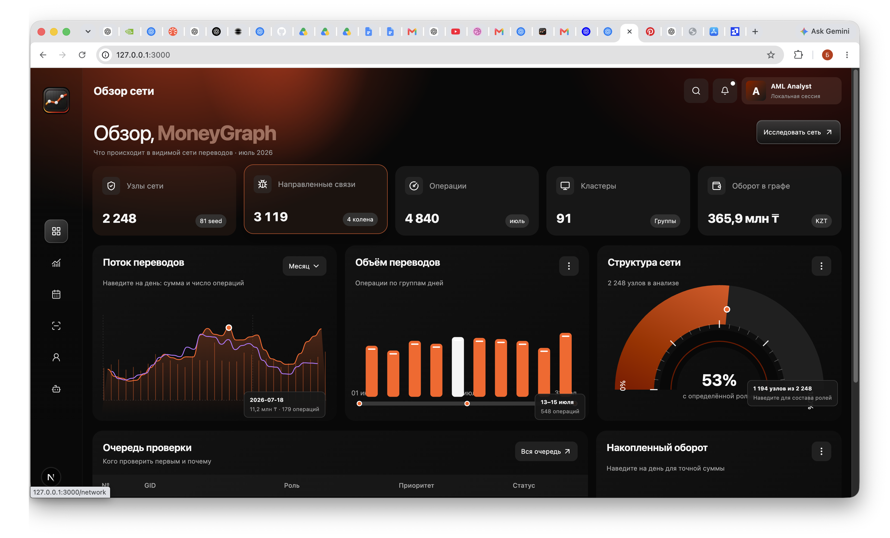
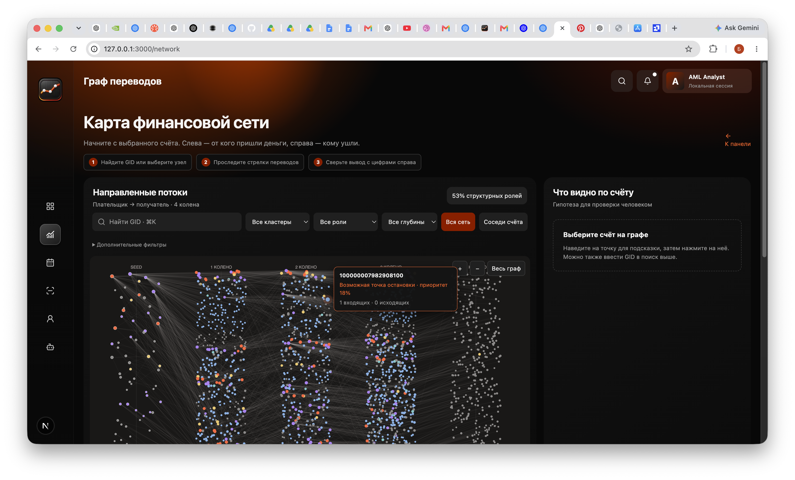
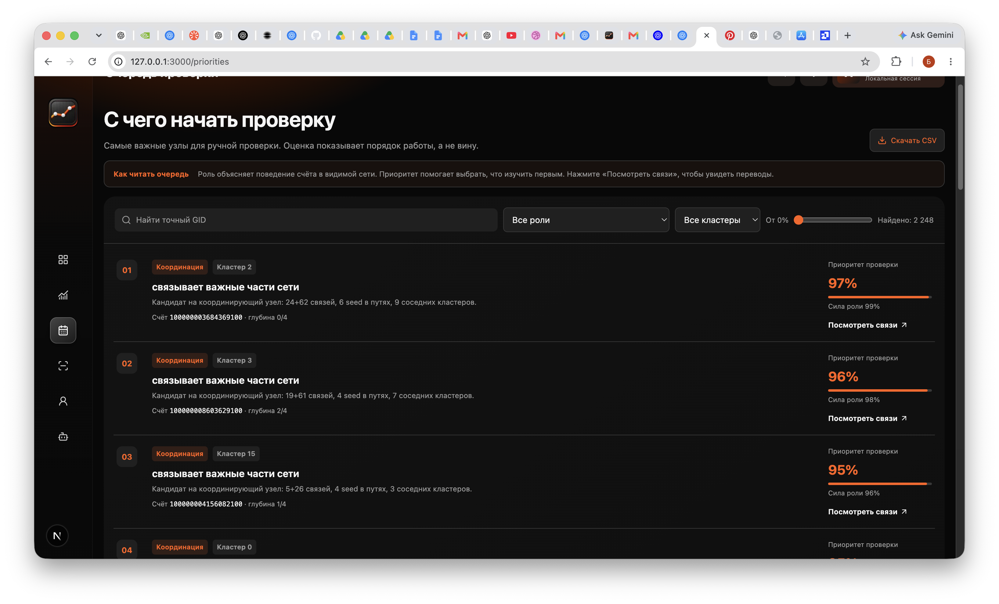
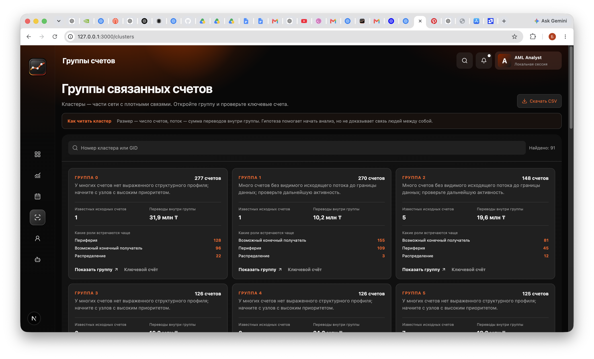
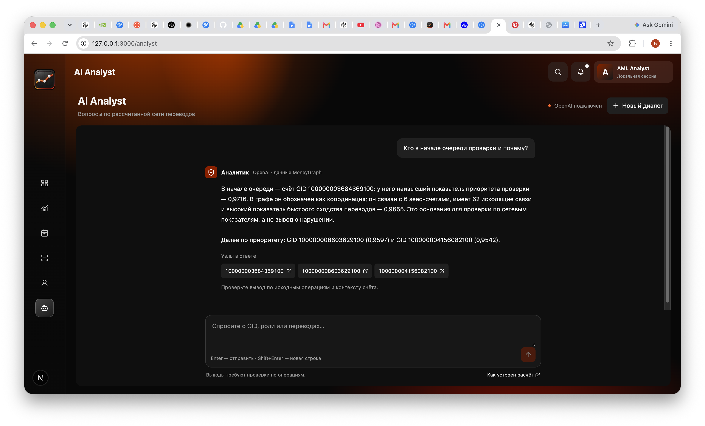

# MoneyGraph — Граф денег

MoneyGraph — локальное рабочее место для AML-аналитика и жюри хакатона. Оно превращает обезличенные переводы в направленный граф и помогает понять, какие счета проверить в первую очередь, какие связи и группы их окружают и на каких наблюдаемых признаках основан вывод.

В приложении нет оценки вины: роль счёта и приоритет проверки — это гипотезы для ручной проверки операций.

## Проблема и пользователи

В большой выгрузке переводов трудно быстро увидеть посредников, точки консолидации и распределения средств, а также связанные группы счетов. MoneyGraph даёт аналитику единый путь от выгрузки до объяснимого списка для проверки:

1. строит граф плательщик → получатель;
2. рассчитывает структурные и временные признаки;
3. выделяет сообщества и вероятные роли;
4. показывает очередь, граф, карточки счетов и выгрузки.

Интерфейс рассчитан на AML-аналитика. Жюри может пройти тот же сценарий, открыть конкретный GID и увидеть данные, из которых сформирован вывод.

## Что реализовано

- Загрузка и валидация <code>nodes.parquet</code>, <code>edges.parquet</code>, <code>transactions.parquet</code>.
- Направленный взвешенный граф переводов с PageRank, взвешенным PageRank, приближённым посредничеством, глубиной обхода, связями между группами и временными признаками.
- Кластеризация Louvain на взвешенной ненаправленной проекции графа.
- Роли: координация, консолидация, распределение, возможный транзит, возможный конечный получатель и периферия.
- Отдельный приоритет проверки с объяснением для каждого счёта.
- CSV-выгрузки ролей, кластеров и топа очереди.
- Полноэкранный интерфейс: обзор, интерактивный граф, очередь проверки, группы счетов, методика и AI Analyst.
- Поиск GID, фильтры по роли, кластеру, глубине и приоритету, просмотр соседей и направленного пути.
- FastAPI для работы с рассчитанным снимком данных.
- AI Analyst с OpenAI Responses API: в модель передаются только относящиеся к вопросу рассчитанные факты, а упомянутые GID открываются в графе.

## Интерфейс

<table>
  <tr>
    <td width="33%"> Обзор сети</td>
    <td width="33%"> Граф переводов</td>
    <td width="33%"> Очередь проверки</td>
  </tr>
  <tr>
    <td width="33%"> Группы счетов</td>
    <td width="33%"> AI Analyst</td>
    <td width="33%"></td>
  </tr>
</table>

## Как работает решение

<pre><code>Parquet-данные
      │
      ▼
Валидация → графовые и временные признаки → кластеры, роли, приоритет
      │
      ▼
CSV-выгрузки + dashboard.json
      │
      ▼
FastAPI → Next.js интерфейс и AI Analyst
</code></pre>

Основной сценарий:

1. Пайплайн читает обезличенные данные и проверяет схему, уникальность GID, концы рёбер, суммы и согласованность агрегированных связей с транзакциями.
2. Для каждого счёта рассчитываются показатели сети и активности: число входящих и исходящих связей, объёмы, центральность, достижимость исходных счетов, быстрые похожие суммы и другие признаки.
3. Счета объединяются в группы, получают роль и приоритет проверки.
4. Пайплайн сохраняет результаты в <code>outputs/</code>.
5. FastAPI отдаёт рассчитанные данные интерфейсу. Аналитик может открыть очередь, выбрать GID, изучить связи, группу и задать вопрос AI Analyst.

## Технологии

| Задача | Технологии |
|---|---|
| Пайплайн и API | Python, pandas, NumPy, SciPy, NetworkX, PyArrow, FastAPI, Uvicorn |
| Веб-интерфейс | Next.js 16, React 19, TypeScript |
| Стили и компоненты | Tailwind CSS 4, shadcn/ui-структура, Lucide React, Border Beam |
| AI Analyst | OpenAI Python SDK, OpenAI Responses API, модель из <code>OPENAI_MODEL</code> |
| Тесты | pytest, FastAPI TestClient |

## Архитектура проекта

<pre><code>data/*.parquet
      │
      ▼
pipeline.py ───────────────► outputs/*.csv + outputs/dashboard.json
                                     │
                                     ▼
                              backend/main.py
                              FastAPI /api/*
                                     │
                                     ▼
                       Next.js: app/ + components/
</code></pre>

| Компонент | Назначение |
|---|---|
| <code>pipeline.py</code> | Валидация данных, признаки, роли, кластеры, приоритеты и экспорт результатов |
| <code>outputs/</code> | Рассчитанные CSV и снимок <code>dashboard.json</code> |
| <code>backend/main.py</code> | Read-only API для графа, поиска, узлов, кластеров, путей, устойчивости и AI Analyst |
| <code>app/</code>, <code>components/</code> | Страницы и интерактивные элементы Next.js |
| <code>tests/test_product.py</code> | Проверка инвариантов данных и ключевых API-сценариев |

## Данные и интеграции

Набор данных хранится в <code>data/</code> и включает:

| Файл | Содержание |
|---|---|
| <code>nodes.parquet</code> | Уникальные GID, глубина появления и признак исходного счёта |
| <code>edges.parquet</code> | Агрегированные пары плательщик → получатель, суммы и количество операций |
| <code>transactions.parquet</code> | Отдельные операции с датой и суммой |

Текущий снимок охватывает июль 2026 года: **2 248 счетов**, **3 119 направленных связей**, **4 840 операций**, **81 исходный счёт**, **91 кластер** и наблюдаемый оборот **365,9 млн ₸**.

OpenAI используется только для AI Analyst и только после добавления локального ключа. Остальная аналитика, граф, роли, CSV и API работают без внешних сервисов.

## Установка и запуск

### Требования

- Python 3.10+
- Node.js 20.9+
- npm

### Быстрый запуск

<pre><code>git clone https://github.com/BAITC-Hacks/hack-463a9525-500.git
cd hack-463a9525-500
./run.sh
</code></pre>

Скрипт создаёт виртуальное окружение при необходимости, устанавливает зависимости, пересчитывает <code>outputs/</code>, запускает FastAPI на <code>http://127.0.0.1:8000</code> и Next.js на <code>http://127.0.0.1:3000</code>.

API-документация доступна по адресу <code>http://127.0.0.1:8000/docs</code>.

### Запуск вручную

В первом терминале:

<pre><code>python3 -m venv .venv
.venv/bin/python -m pip install -r requirements.txt
.venv/bin/python pipeline.py --data data --out outputs
MONEYGRAPH_OUTPUT_DIR="$PWD/outputs" .venv/bin/python -m uvicorn backend.main:app --host 127.0.0.1 --port 8000
</code></pre>

Во втором терминале:

<pre><code>npm ci
BACKEND_URL=http://127.0.0.1:8000 npm run dev -- --port 3000
</code></pre>

### Настройка AI Analyst

Скопируйте шаблон и внесите локальный ключ:

<pre><code>cp .env.example .env.local
</code></pre>

<pre><code>MONEYGRAPH_OPENAI_API_KEY=ваш_ключ
OPENAI_MODEL=gpt-6-luna
</code></pre>

После этого перезапустите <code>./run.sh</code>. <code>.env.local</code> находится в <code>.gitignore</code>; ключ не передаётся в браузер и не должен попадать в Git.

## Как проверить решение

1. Запустите проект и откройте <code>http://127.0.0.1:3000</code>.
2. На главной странице проверьте показатели: 2 248 счетов, 3 119 связей и 4 840 операций.
3. Откройте «Очередь проверки» и выберите первый GID. Нажмите «Посмотреть связи».
4. На странице графа посмотрите входящих и исходящих соседей, роль, глубину, приоритет и ограничения наблюдаемой сети.
5. Откройте «Группы счетов», выберите группу и перейдите к ключевому счёту.
6. Откройте «Методика», чтобы сверить критерии ролей и границы данных.
7. При настроенном OpenAI API key откройте AI Analyst и спросите: «Почему GID 100000003684369100 в начале очереди?»
8. Проверьте сборку и тесты:

<pre><code>.venv/bin/python -m pytest -q
npm run typecheck
npm run build
</code></pre>

## API

Основные маршруты FastAPI:

- <code>GET /api/overview</code> — показатели и ограничения снимка.
- <code>GET /api/graph</code> — отфильтрованный граф.
- <code>GET /api/nodes/{gid}</code> — карточка счёта, связи, признаки и ограничения.
- <code>GET /api/top-nodes</code> — очередь проверки.
- <code>GET /api/clusters</code> и <code>GET /api/clusters/{cluster_id}</code> — группы счетов.
- <code>GET /api/search?q=</code> — поиск GID.
- <code>GET /api/path?source=&target=</code> — направленный путь.
- <code>GET /api/resilience?remove_top=</code> — структурный эксперимент при удалении топ-узлов.
- <code>POST /api/analyst</code> — ответ AI Analyst при настроенном ключе OpenAI.

Полное описание параметров доступно в Swagger UI: <code>http://127.0.0.1:8000/docs</code>.

## Ограничения текущей версии

- Данные ограничены исходящим обходом от 81 исходного счёта до глубины 4.
- В выборке отсутствуют переводы менее 5 000 ₸ и внешние входящие операции.
- Для узла на четвёртой глубине отсутствие исходящих операций не означает завершение движения средств.
- Нет данных о владельцах счетов и размеченной истины, поэтому роль и приоритет нельзя использовать как доказательство нарушения.
- Текущая реализация NetworkX и полная загрузка <code>dashboard.json</code> рассчитаны на предоставленный набор из 2 248 узлов. Для существенно больших графов потребуются пакетная обработка и специализированное графовое хранилище.
- Развёрнутая версия в репозитории не указана. Проект запускается локально.

## Полезные файлы

- [Описание датасета](data/README.md)
- [Схема решения](docs/architecture.md)
- [Переменные окружения](.env.example)
