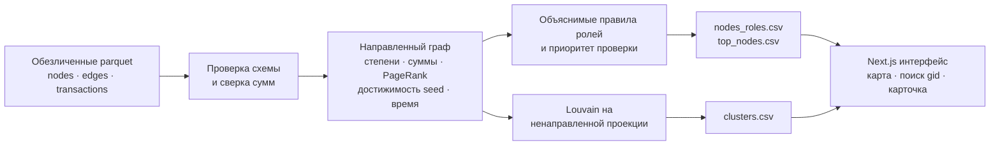

# Схема решения

```mermaid
flowchart LR
    A[Обезличенные parquet<br/>nodes · edges · transactions] --> B[Проверка схемы<br/>и сверка сумм]
    B --> C[Направленный граф<br/>степени · суммы · PageRank<br/>достижимость seed · время]
    C --> D[Объяснимые правила ролей<br/>и приоритет проверки]
    C --> E[Louvain на<br/>ненаправленной проекции]
    D --> F[nodes_roles.csv<br/>top_nodes.csv]
    E --> G[clusters.csv]
    F --> H[Next.js интерфейс<br/>карта · поиск gid · карточка]
    G --> H
```

Ненаправленная проекция используется только для поиска сообществ. Роли, потоки и связи на экране сохраняют направление перевода.
