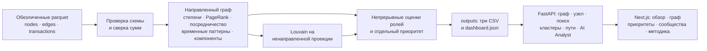

# Схема решения

Ненаправленная проекция используется только для поиска сообществ. Роли, пути и связи сохраняют направление перевода. API и UI читают рассчитанный снимок; ответы AI Analyst ссылаются на измеренные GID и признаки.
